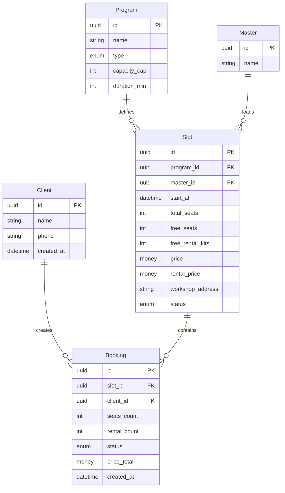
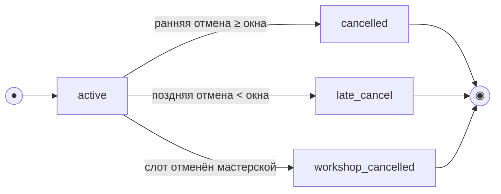

# Модель данных

> Этап 2. Проектирование. Ресурсная модель API для клиентского приложения «Глина».
>
> **Скоуп:** клиентское приложение + контракт API. Хранение и бизнес-логика — black-box
> бэкенда (R-004). В учебном проекте — **mock-репозитории**, реализующие этот контракт.

- **Program, Master, Slot** — read-only (из API).
- **Client, Booking** — создаются/изменяются клиентским API.
- Каноническая схема — контракт API (R-015); легаси-данных нет.

## Сущности и атрибуты

### Client (Клиент)

| Атрибут | Тип | Описание |
| :-- | :-- | :-- |
| id | UUID (PK) | Идентификатор клиента |
| name | string | Имя |
| phone | string (unique) | Телефон (E.164); вход по SMS OTP |
| created_at | datetime | Дата регистрации |

OTP-код в модели не хранится — проверка на стороне бэкенда/mock.

### Program (Программа) — справочник, read-only

| Атрибут | Тип | Описание |
| :-- | :-- | :-- |
| id | UUID (PK) | Идентификатор программы |
| name | string | Название («Лепка для новичков», «Работа на гончарном круге») |
| description | string? | Описание для карточки слота |
| type | enum (`handbuilding` / `wheel`) | `handbuilding` — лепка; `wheel` — гончарный круг |
| capacity_cap | int | Потолок мест: лепка ≤ **6**, круг ≤ **10** |
| duration_min | int | Длительность, мин (120–150) |

### Master (Мастер) — справочник, read-only

| Атрибут | Тип | Описание |
| :-- | :-- | :-- |
| id | UUID (PK) | Идентификатор мастера |
| name | string | Имя мастера |

### Slot (Слот / мастер-класс) — read-only для клиента

| Атрибут | Тип | Описание |
| :-- | :-- | :-- |
| id | UUID (PK) | Идентификатор слота |
| program_id | FK → Program | Программа |
| master_id | FK → Master | Мастер |
| start_at | datetime (UTC) | Начало в UTC; отображение — локальная зона; ранняя/поздняя отмена — по `cancellation_window_minutes` из API (R-021) |
| total_seats | int | Всего мест (≤ program.capacity_cap) |
| free_seats | int | Свободно мест |
| free_rental_kits | int | **Проекция** общего прокатного фонда мастерской (до **8** комплектов, R-023) на этот слот и момент времени. Вычисляет бэкенд с учётом пересечений по времени с другими слотами; **не** независимый локальный «запас 8» на каждый слот. Клиент отображает как read-only. |
| price | money (RUB) | Цена за место |
| rental_price | money (RUB) | Тариф проката за один комплект (фартук + инструменты); «своё» бесплатно |
| workshop_address | string | Адрес мастерской (текст) |
| cancellation_reason | string? | Причина отмены слота (если `status = cancelled`) |
| status | enum (`scheduled` / `cancelled`) | Статус слота |

### Booking (Запись / бронь)

| Атрибут | Тип | Описание |
| :-- | :-- | :-- |
| id | UUID (PK) | Идентификатор записи |
| slot_id | FK → Slot | Слот |
| client_id | FK → Client | Клиент |
| seats_count | int | Мест в записи (1–3), без имён гостей (R-013) |
| rental_count | int | Число мест с прокатом (0..seats_count) |
| status | enum | см. [модель состояний](#модель-состояний) |
| price_total | money (RUB), read-only | Итог от сервера: `price × seats_count + rental_price × rental_count` (R-005) |
| created_at | datetime | Создание |
| cancelled_at | datetime? | Отмена |
| workshop_cancel_reason | string? | Причина при `status = workshop_cancelled` (R-008) |

**Статусы брони:** `active`, `cancelled`, `late_cancel`, `workshop_cancelled`.

> «Прошедшая» — **не статус**, а производное по `slot.start_at < now`.

## ERD

## Модель состояний

### Booking

| Из | Событие | В | Эффект на слот |
| :-- | :-- | :-- | :-- |
| — | createBooking | `active` | `free_seats -= seats_count`; `free_rental_kits -= rental_count` |
| `active` | cancel ≥ window | `cancelled` | Места и прокат **возвращаются** |
| `active` | cancel < window | `late_cancel` | Места и прокат **не освобождаются** |
| `active` | Slot → cancelled | `workshop_cancelled` | UI: причина; CTA записи недоступна |

### Slot

`scheduled` → `cancelled` (инициатор — инфраструктура мастерской).

## Инварианты

- `max_seats_for_booking = min(free_seats, 3)` (FR-13). Потолок программы уже учтён в `total_seats` / `free_seats` слота.
- `rental_count ≤ free_rental_kits` и `rental_count ≤ seats_count` (FR-14).
- `price_total` — только read-only от API (FR-45).
- Параллельные брони — без овербукинга (NFR-8); в mock — in-memory lock / проверка.

## Маппинг Dart (слои)

| Концепт | Dart type | Слой |
| :-- | :-- | :-- |
| Program | `ProgramEntity` | domain |
| Master | `MasterEntity` | domain |
| Slot | `SlotEntity` | domain |
| Booking | `BookingEntity` | domain |
| Client | `ClientEntity` | domain |
| JSON DTO | `*Model` / `*Dto` | data |
| Repository contract | `I*Repository` | domain/repositories |
| Repository impl | `*RepositoryMock`, `*RepositoryImpl` | data/repositories |
| Use-case orchestration | `I*Service`, `*ServiceImpl` | **application** |
| UI state | `*Bloc`, `*Screen` | presentation |

Бизнес-валидация (FR-13, FR-14, FR-22) — в **ServiceImpl**, не в BLoC и не в Repository.
