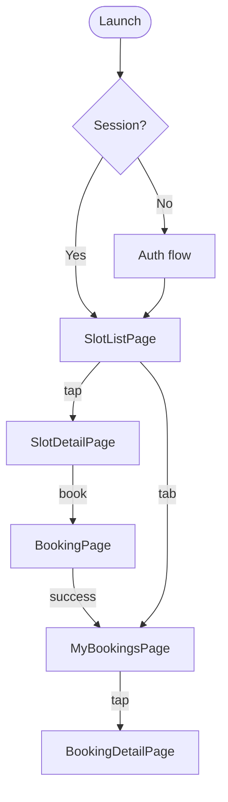
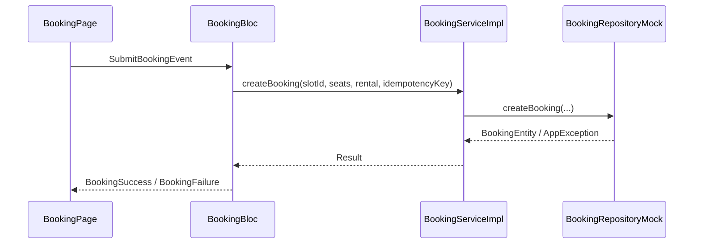

# Архитектура Flutter-приложения «Глина»

> Этап 2. План реализации клиентского приложения.
> Стек: **Flutter**, **flutter_bloc**, **equatable**, **get_it** (DI), mock-репозитории.

## Принципы

1. **Clean Architecture** — зависимости только внутрь.
2. **Цепочка слоёв (обязательно):**

```
Widget → BLoC → I_Service → ServiceImpl → I_Repository → RepositoryImpl → Mock/API
```

3. BLoC **не** вызывает Repository напрямую.
4. Widget **без** бизнес-логики.
5. Domain-entities **без** импортов Flutter.

## Структура проекта

```
app/
├── pubspec.yaml
└── lib/
    ├── main.dart
    ├── app/
    │   ├── app.dart                 # MaterialApp, theme, l10n
    │   └── router.dart              # go_router / Navigator 2.0
    ├── core/
    │   ├── di/
    │   │   └── injection.dart       # get_it регистрация
    │   ├── error/
    │   │   ├── app_exception.dart
    │   │   └── failure.dart
    │   ├── network/                 # (Phase 3+) abstract api client
    │   ├── theme/
    │   │   └── app_theme.dart
    │   └── l10n/                    # flutter gen-l10n, ru
    └── features/
        ├── auth/
        ├── slots/
        ├── booking/
        ├── my_bookings/
        └── profile/                 # Should, Phase 3+
```

## Feature module (шаблон)

Каждая фича повторяет структуру [Deriverse/statistics_data](https://github.com/...) :

```
features/slots/
├── domain/
│   ├── entities/
│   │   └── slot_entity.dart
│   └── repository/
│       └── i_slots_repository.dart
├── data/
│   ├── models/
│   │   └── slot_model.dart
│   ├── mappers/
│   │   └── slot_mapper.dart
│   └── repository/
│       └── slots_repository_mock.dart
├── application/
│   ├── i_slots_service.dart
│   └── slots_service_impl.dart
└── presentation/
    ├── bloc/
    │   ├── slots_bloc.dart
    │   ├── slots_event.dart
    │   └── slots_state.dart
    ├── pages/
    │   └── slot_list_page.dart
    └── widgets/
        └── slot_card.dart
```

## Feature modules (MVP)

| Feature | US/UC | Repository | Service | BLoC | Экраны |
| :-- | :-- | :-- | :-- | :-- | :-- |
| **auth** | US-1, UC-5 | `IAuthRepository` | `IAuthService` | `AuthBloc` | Login, OTP, Name |
| **slots** | US-2,3,4 UC-3 | `ISlotsRepository` | `ISlotsService` | `SlotsBloc` | SlotList, SlotDetail |
| **booking** | US-5–8 UC-1 | `IBookingRepository`* | `IBookingService` | `BookingBloc` | BookingForm, Success |
| **my_bookings** | US-9,10,16 UC-2,4 | `IBookingRepository` | `IMyBookingsService` | `MyBookingsBloc` | List, Detail, Cancel |

\* Один `IBookingRepository` — разные сервисы (create vs list/cancel).

## Навигация



## Dependency Injection (get_it)

```dart
// Псевдокод регистрации
getIt.registerLazySingleton<IAuthRepository>(() => AuthRepositoryMock());
getIt.registerLazySingleton<IAuthService>(
  () => AuthServiceImpl(repository: getIt()),
);
getIt.registerFactory<AuthBloc>(() => AuthBloc(service: getIt()));
// ... slots, booking, my_bookings
```

Mock-реализации регистрируются по умолчанию; swap на `*RepositoryImpl` + HTTP — без смены BLoC/Service.

## State management (BLoC)

| BLoC | Events (пример) | States (пример) |
| :-- | :-- | :-- |
| AuthBloc | RequestCode, VerifyCode, SetName | Initial, Loading, CodeSent, Authenticated, Error |
| SlotsBloc | Load, ApplyFilters, Refresh | Loading, Loaded, Empty, Error |
| BookingBloc | SetSeats, SetRental, Submit | Editing, Submitting, Success, Error(slot_full) |
| MyBookingsBloc | Load, Cancel | Loading, Loaded, Cancelling, Error |

## Data flow (пример: запись на слот)



## Mapping API ↔ Domain

- **data/models** — JSON-serializable DTO (`SlotModel`).
- **mappers** — `SlotModel.toEntity()` → `SlotEntity`.
- **ServiceImpl** — бизнес-правила: валидация `rental_count ≤ seats_count`, проброс кодов ошибок.
- **BLoC** — маппинг Failure → user-facing message (l10n).

## Тестирование (план)

| Уровень | Что |
| :-- | :-- |
| Service | unit-тесты с mock repository |
| BLoC | bloc_test |
| Widget | smoke на Test Panel (по желанию) |

## Этап 3 (bootstrap)

1. `flutter create app --org com.surf.glina`
2. Зависимости: `flutter_bloc`, `equatable`, `get_it`, `intl`
3. `core/di`, theme, l10n ru
4. Пустые feature-модули с интерфейсами
5. README: `flutter run`

## Связанные документы

- [data-model.md](01-analysis/4-design/data-model.md)
- [api-contract.md](01-analysis/4-design/api-contract.md)
- [functional-requirements.md](01-analysis/2-requirements/functional-requirements.md)
