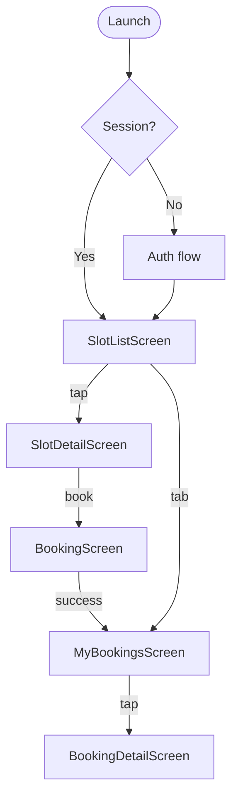

# Архитектура Flutter-приложения «Глина»

> Этап 2. План реализации клиентского приложения.
> Стек и структура — **по образцу Deriverse/frontend** (см. `cursor_project_structure_guidelines.md`),
> с обязательным слоем **application/** (I_Service → ServiceImpl) по требованию проекта.

**Package name:** `glina` → импорты только `package:glina/...`

**Платформа:** iOS/Android (mobile), не Web — web conditional imports не нужны.

## Принципы

1. **Feature-first Clean Architecture** — зависимости только внутрь.
2. **Направление зависимостей (strict):**

```
presentation → application → domain ← data
```

3. **Цепочка вызовов (обязательно для этого проекта):**

```
Widget → BLoC → I_Service → ServiceImpl → I_Repository → RepositoryImpl/Mock → data source
```

4. BLoC вызывает **I_Service**, не Repository.
5. Widget **без** бизнес-логики.
6. **domain** — без Flutter, data sources, presentation.
7. **application** — оркестрация use cases; зависит только от **domain** (интерфейсы репозиториев и entities).

## Слой application (обязательный)

Папка `features/<name>/application/` — **не опциональна**. Это слой между presentation и data.

| Слой | Ответственность | Пример «Глина» |
| :-- | :-- | :-- |
| **domain** | Контракты и сущности | `ISlotsRepository`, `SlotEntity` |
| **data** | I/O, DTO, mock/API | `SlotsRepositoryMock`, `SlotModel` |
| **application** | Бизнес-правила, оркестрация | `ISlotsService`, `SlotsServiceImpl` |
| **presentation** | UI-состояние | `SlotsBloc`, `SlotListScreen` |

**В application (ServiceImpl):**

- валидация до вызова репозитория (`rental_count ≤ seats_count`, `seats_count ≤ 3`);
- генерация/проброс `Idempotency-Key` для booking;
- маппинг доменных ошибок репозитория в типизированные failure-коды для BLoC;
- композиция нескольких вызовов repo (если нужно).

**Не в application:**

- HTTP, JSON, in-memory storage → **data**;
- `BuildContext`, l10n, навигация → **presentation** (BLoC/Widget);
- чистые формулы без I/O → **domain/use_cases** (опционально).

### Интерфейс и реализация

```dart
// features/booking/application/i_booking_service.dart
abstract interface class IBookingService {
  Future<BookingEntity> createBooking({
    required String slotId,
    required int seatsCount,
    required int rentalCount,
    required String idempotencyKey,
  });
}

// features/booking/application/booking_service_impl.dart
class BookingServiceImpl implements IBookingService {
  BookingServiceImpl({required IBookingRepository repository})
    : _repository = repository;

  final IBookingRepository _repository;

  @override
  Future<BookingEntity> createBooking({...}) async {
    if (rentalCount > seatsCount) {
      throw const AppException.invalidRentalCount();
    }
    return _repository.createBooking(...);
  }
}
```

### Сервисы по feature (MVP)

| Feature | Interface | Impl | Ключевые методы |
| :-- | :-- | :-- | :-- |
| auth | `IAuthService` | `AuthServiceImpl` | `requestCode`, `verifyCode`, `setName`, `logout` |
| slots | `ISlotsService` | `SlotsServiceImpl` | `listSlots`, `getSlot` |
| booking | `IBookingService` | `BookingServiceImpl` | `createBooking` |
| my_bookings | `IMyBookingsService` | `MyBookingsServiceImpl` | `listBookings`, `getBooking`, `cancelBooking` |

> `IBookingRepository` общий для booking и my_bookings; сервисы разделены по use case (создание vs просмотр/отмена).

## Структура проекта (целевая)

```
app/
├── pubspec.yaml
├── analysis_options.yaml          # Very Good Analysis
└── lib/
    ├── main.dart
    ├── app/
    │   ├── app.dart               # MaterialApp, theme, l10n
    │   └── router.dart            # go_router
    ├── core/
    │   ├── constants/
    │   ├── style/                 # palette, ThemeExtension (как Deriverse)
    │   │   ├── palette.dart
    │   │   └── app_theme.dart
    │   ├── exception/
    │   ├── helper/
    │   └── widgets/               # общие UI-компоненты
    ├── dependency_injection/
    │   └── locator/
    │       └── locator.dart       # GetIt, global `locator`
    ├── l10n/                      # app_ru.arb (+ app_en.arb как source)
    └── features/
        ├── auth/
        ├── slots/
        ├── booking/
        ├── my_bookings/
        └── profile/               # Should
```

## Feature module (шаблон — Deriverse + application layer)

Референсы Deriverse: `priority_fee` (domain/data/presentation), `statistics_data` (+ application).

```
features/slots/
├── domain/
│   ├── entities/
│   │   └── slot_entity.dart
│   ├── repositories/                    # plural, как Deriverse
│   │   └── i_slots_repository.dart        # abstract interface class
│   ├── use_cases/                         # опционально — чистая логика
│   └── enums/
├── data/
│   ├── models/
│   │   └── slot_model.dart
│   ├── mappers/
│   │   └── slot_mapper.dart
│   ├── data_sources/
│   │   └── local/
│   │       └── slots_mock_data_source.dart
│   └── repositories/
│       ├── slots_repository_mock.dart     # MVP default
│       └── slots_repository_impl.dart     # Phase 3+ / Dio
├── application/
│   ├── i_slots_service.dart
│   └── slots_service_impl.dart
└── presentation/
    ├── manager/
    │   └── slots_bloc/
    │       ├── slots_bloc.dart
    │       ├── slots_event.dart           # part of bloc
    │       └── slots_state.dart           # part of bloc
    ├── widgets/
    └── screens/
        └── slot_list_screen.dart
```

> **Отличие от «чистого» Deriverse:** слой `application/` обязателен (BLoC → Service → Repo).
> В Deriverse `statistics_data` уже использует этот паттерн.

## Feature modules (MVP)

| Feature | US/UC | Repository | Service | BLoC | Экраны |
| :-- | :-- | :-- | :-- | :-- | :-- |
| **auth** | US-1, UC-5 | `IAuthRepository` | `IAuthService` | `AuthBloc` | Login, OTP, Name |
| **slots** | US-2,3,4 UC-3 | `ISlotsRepository` | `ISlotsService` | `SlotsBloc` | SlotList, SlotDetail |
| **booking** | US-5–8 UC-1 | `IBookingRepository`* | `IBookingService` | `BookingBloc` | BookingForm, Success |
| **my_bookings** | US-9,10,16 UC-2,4 | `IBookingRepository` | `IMyBookingsService` | `MyBookingsBloc` | List, Detail, Cancel |

\* Один `IBookingRepository` — разные сервисы (create vs list/cancel).

## BLoC conventions (Deriverse)

```dart
class SlotsBloc extends Bloc<SlotsEvent, SlotsState> {
  SlotsBloc({required ISlotsService service})
    : _service = service,
      super(const SlotsState.initial()) {
    on<SlotsEvent>((event, emit) async {
      switch (event) {
        case LoadSlotsEvent():
          await _onLoad(emit);
      }
    });
  }

  final ISlotsService _service;

  @override
  Future<void> close() {
    // cancel subscriptions
    return super.close();
  }
}

part 'slots_event.dart';
part 'slots_state.dart';
```

- Events: `sealed class` + `Equatable`
- States: `Equatable` + `copyWith`
- `switch (event)` — pattern matching
- Подписки отменять в `close()`

## Repository pattern

```dart
// domain/repositories/i_slots_repository.dart
abstract interface class ISlotsRepository {
  Future<List<SlotEntity>> listSlots(SlotsFilter filter);
}

// data/repositories/slots_repository_mock.dart
class SlotsRepositoryMock implements ISlotsRepository { ... }
```

- Интерфейс — **domain/repositories/**
- Реализация — **data/repositories/** (`*Mock`, `*Impl`, `*Stub`)
- Mock data — **data/data_sources/local/** или внутри mock repo

## Dependency Injection (GetIt)

Файл: `lib/dependency_injection/locator/locator.dart`, global `locator`.

```dart
locator.registerLazySingleton<ISlotsRepository>(SlotsRepositoryMock.new);
locator.registerLazySingleton<ISlotsService>(
  () => SlotsServiceImpl(repository: locator()),
);
locator.registerFactory<SlotsBloc>(
  () => SlotsBloc(service: locator()),
);
```

Mock-реализации регистрируются по умолчанию; swap на `*RepositoryImpl` + HTTP — без смены BLoC/Service.

## Theme & l10n (Deriverse rules)

| Правило | «Глина» |
| :-- | :-- |
| No magic numbers | цвета/размеры через `ThemeExtension` + `palette.dart` |
| l10n | все UI-строки в `lib/l10n/app_ru.arb` (минимум ru; en — source для gen-l10n) |
| Comments | **English only** in code |
| Imports | **package:glina/...** only, not relative `../` |
| Format | `dart format`, page width **80**, trailing commas |
| Analyze | Very Good Analysis, zero new warnings |

## Test Panel

В Deriverse — **обязательно** для каждого нового виджета.
Для учебного MVP: завести `features/dev_panel/` (упрощённый каталог состояний) или добавлять по мере фич.
Приоритет этапа 3: skeleton; полный Test Panel — по мере реализации UI.

## Навигация



## Data flow (пример: запись на слот)


## Mapping API ↔ Domain

- **data/models** — JSON-serializable DTO (`SlotModel`).
- **mappers** — `SlotModel.toEntity()` → `SlotEntity`.
- **ServiceImpl** — бизнес-правила: валидация `rental_count ≤ seats_count`, проброс кодов ошибок.
- **BLoC** — маппинг Failure → user-facing message (l10n).

## State management (BLoC)

| BLoC | Events (пример) | States (пример) |
| :-- | :-- | :-- |
| AuthBloc | RequestCode, VerifyCode, SetName | Initial, Loading, CodeSent, Authenticated, Error |
| SlotsBloc | Load, ApplyFilters, Refresh | Loading, Loaded, Empty, Error |
| BookingBloc | SetSeats, SetRental, Submit | Editing, Submitting, Success, Error(slot_full) |
| MyBookingsBloc | Load, Cancel | Loading, Loaded, Cancelling, Error |

## Тестирование (план)

| Уровень | Что |
| :-- | :-- |
| Service | unit-тесты с mock repository |
| BLoC | bloc_test |
| Widget | smoke на dev_panel (по мере готовности) |

## Этап 3 (bootstrap)

1. `flutter create app --org com.surf.glina`
2. Зависимости: `flutter_bloc`, `equatable`, `get_it`, `go_router`, `intl`, `very_good_analysis`
3. `dependency_injection/locator/locator.dart`, `core/style/`, `l10n/app_ru.arb`
4. Feature-модули по шаблону выше (repo interfaces + mock repos + **service interfaces/impl**)
5. `flutter analyze` — без новых warnings

## Checklist перед merge (Deriverse)

- [ ] domain / data / application / presentation структура
- [ ] `I*` в domain, `*Impl`/`*Mock` в data
- [ ] BLoC → Service → Repository (не напрямую к repo)
- [ ] ThemeExtension, без magic numbers
- [ ] Строки в l10n
- [ ] Регистрация в `locator.dart`
- [ ] Trailing commas, package imports, English comments
- [ ] CHANGELOG + PLATF-XXX commit

## Связанные документы

- [data-model.md](01-analysis/4-design/data-model.md)
- [api-contract.md](01-analysis/4-design/api-contract.md)
- [functional-requirements.md](01-analysis/2-requirements/functional-requirements.md)
